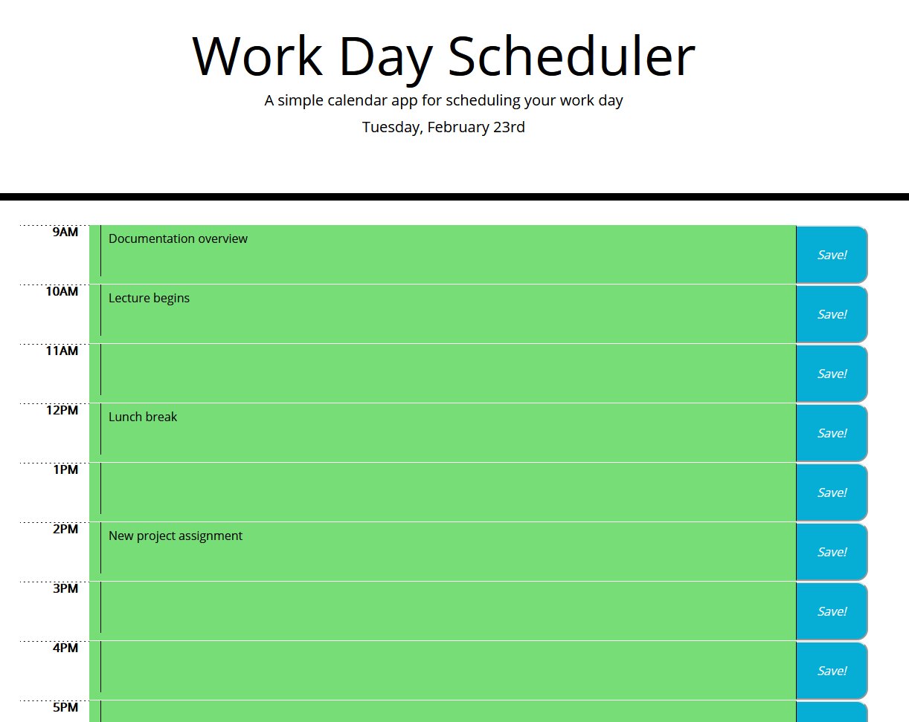

# Workday-Scheduler
## Description
A time management application powered by JQuery that allows the user to list when various tasks are scheduled throughout the day as well as dynamically showing what and when things are scheduled throughout the day. It will also update with color-coding styles to display which time blocks have passed that day, which ones are still upcoming, and which one you're currently in.

## Deployment
To view the deployed and current project: https://accoon.github.io/Workday-Scheduler/

## Usage

On loading the page, the current date is displayed and the application will check to see if there was a previously saved schedule. If there was, it checks the date of the previous save. If the previous schedule was from a different day, or there was no previous schedule, then the application will load with empty time blocks.

Each time block in the planner is dynamically color-coded based on current time to show whether that time block is past, future, or present with gray, green, and red respectively.

To add an entry, simply click in the empty space within each time block and type in any events and notes you want to add. You can save this information by clicking the blue Save button to the right of the respective time block.

If an entry has been saved, then that information will remain even after the page is reloaded.

## Credit
The HTML and CSS code of this project was provided by Trilogy Education Services, LLC, a 2U, Inc. brand.